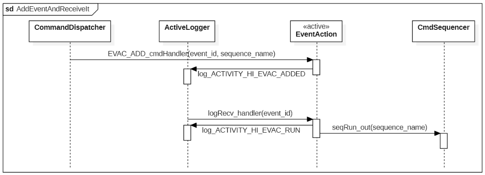
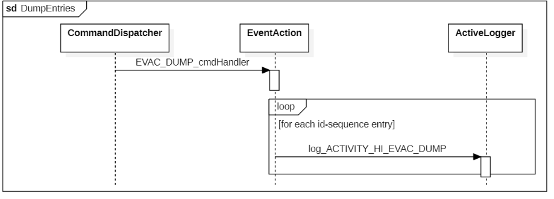

\page AppEventAction App::EventAction Component
# App::EventAction Component

## 1. Introduction

The `App::EventAction` component allows to trigger sequences depending on events that occured. Sequences are a series of commands stored as a binary file in the `Svc::CmdSequencer`, it is a core mechanism of F'. 

## 2. Requirements

The requirements for `App::EventAction` are as follows:

Requirement | Description | Verification Method
----------- | ----------- | -------------------
EVAC-001 | The `App::EventAction` component shall store event-sequences entries | Inspection; Unit Test
EVAC-001 | The `App::EventAction` component shall provide a command to add a new event-sequence entry. | Inspection; Unit Test
EVAC-001 | The `App::EventAction` component shall provide a command to remove an event-sequence entry. | Inspection; Unit Test
EVAC-001 | The `App::EventAction` component shall provide a command to dump the current event-sequence entries. | Inspection; Unit Test
EVAC-001 | The `App::EventAction` component shall trigger a specific sequence depeding on received events. | Inspection; Unit Test

## 3. Design

### 3.1 Context

#### 3.1.1 Component Diagram

The `App::EventAction` component has the following component diagram:

#### 3.1.2 Ports

The `App::EventAction` component uses the following port types:

Port Data Type | Name | Direction | Kind | Usage
-------------- | ---- | --------- | ---- | -----
`Fw::Log` | logRecv | Input | Asynchronous | Receive events from components
`Fw::CmdSeqIn` | seqRun | Output | - | Send sequence name to `CmdSequencer`
`Fw::CmdResponse` | seqResp | Output | - | Receive sequence response from `CmdSequencer`

### 3.2 Functional Description

The `App::EventAction` component allows to register entries that will trigger a specific sequence for a desired event id. An specific event id can only trigger one sequence.

The user has to send the `EVAC_ADD` to register a new sequence for a specific event id. When this event will occur, the sequence will be send to the `Svc::CmdSequence` component through the `seqRun` output port. 

The user can remove a sequence for a specific envent id with the `EVAC_REMOVE` and dump current event-sequence registered entries with `EVAC_DUMP`.

NOTE: Event ID value 0 is reserved for the logger.

### 3.3 Scenarios

#### 3.3.1 Add event-sequence entry and receive corresponding events

The `App::EventAction` component add a new event-sequence entry and receive corresponding event id:

 

#### 3.3.1 Dump event-sequence entries

The `App::EventAction` component dumps event-sequence entries:

 

### 3.4 State

`App::EventAction` has no state machines.

### 3.5 Algorithms

`App::EventAction` has no significant algorithms.

## 4. Dictionaries

[Commands - `eventAction_commands.html`](../../Top/commands/eventAction_commands.html)

[Events - `eventAction_events.html`](../../Top/events/eventAction_events.html)

## 5. Unit Testing

[Unit Test Output - `tests.txt`](../test/outputs/tests.txt)

[Coverage Output - `EventActionImpl.cpp`](../test/outputs/coverage/EventActionComponentImpl.cpp.gcov)

[Coverage Output - `EventActionComponentAc.cpp`](../test/outputs/coverage/EventActionComponentAc.cpp.gcov)

[Report - `coverage.txt`](../test/outputs/coverage.txt)

## 7. Change Log

Date | Description
---- | -----------
11/27/2020 | Initial implementation

